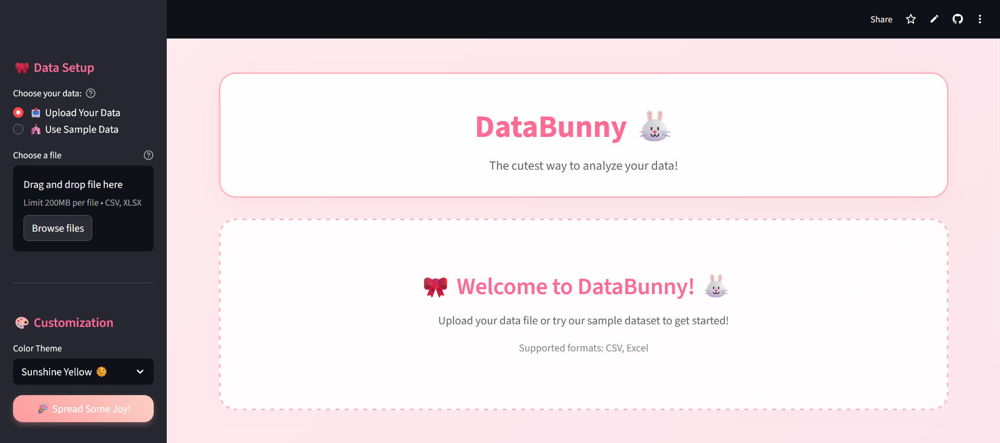

# DataBunny 🐰 - The Cutest Data Analysis Tool



[](https://streamlit.io)
[](https://python.org)
[](LICENSE)
[](CONTRIBUTING.md)

> **Because data analysis should be both powerful and adorable!** ✨

DataBunny is a beautiful, interactive data visualization dashboard built with Streamlit that makes data exploration fun and accessible. Upload your datasets and create stunning visualizations with a cute, playful interface.

## 🌟 Features

### 🎨 **Beautiful Design**
- **Multiple Themes**: Pink Blossom, Mint Candy, Lavender Dream, Sunshine Yellow
- **Cute Animations**: Smooth transitions and hover effects
- **Responsive Layout**: Works perfectly on desktop and mobile
- **Playful UI**: Comic Neue font and rounded elements

### 📊 **Powerful Analysis**
- **File Upload**: Support for CSV and Excel files
- **Automatic Insights**: Smart data summaries and statistics
- **Multiple Chart Types**: Line, Bar, Scatter, Area charts
- **Interactive Visualizations**: Click, zoom, and explore your data
- **Real-time Updates**: Instant chart generation

### 🚀 **User-Friendly**
- **No Code Required**: Perfect for non-technical users
- **Instant Setup**: Upload and analyze in seconds
- **Intuitive Interface**: Simple controls anyone can understand
- **Sample Data**: Try it immediately with built-in datasets

## 🎯 Quick Start

### Prerequisites
- Python 3.8 or higher
- pip package manager

### Installation

1. **Clone the repository**
   ```bash
   git clone https://github.com/GxDrogers/DataBunny.git
   cd DataBunny